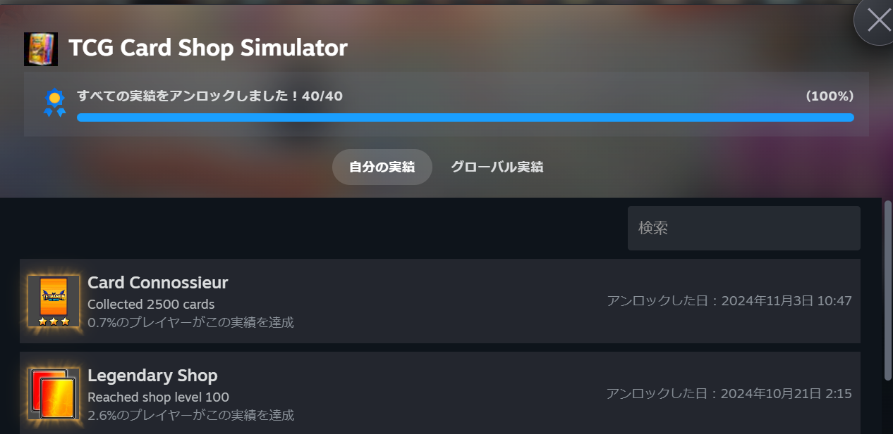

# TCGCardShopSimulator-AHK
AHK for TCG Card Shop Simulator

カードパックを自動開封するためのシンプルな [AutoHotkey](https://www.autohotkey.com/) スクリプトです。

- BOX開封用（推奨）： `TCG_AutoBoxOpener.ahk`
- パック開封用： `TCG_AutoPackOpener.ahk`

※ `使い方` は各スクリプト内に記載しています。

※ スクリプトにより、`キーボード` と `マウス` が操作されます、終了したい場合は `ESC キー` を押して下さい。

## 設定

## 実績

目安：200 - 300時間

## 免責事項

本ソフトウェアの利用により生じた問題は、利用者の責任とし、作成者は一切の責任を負わないものとします。
